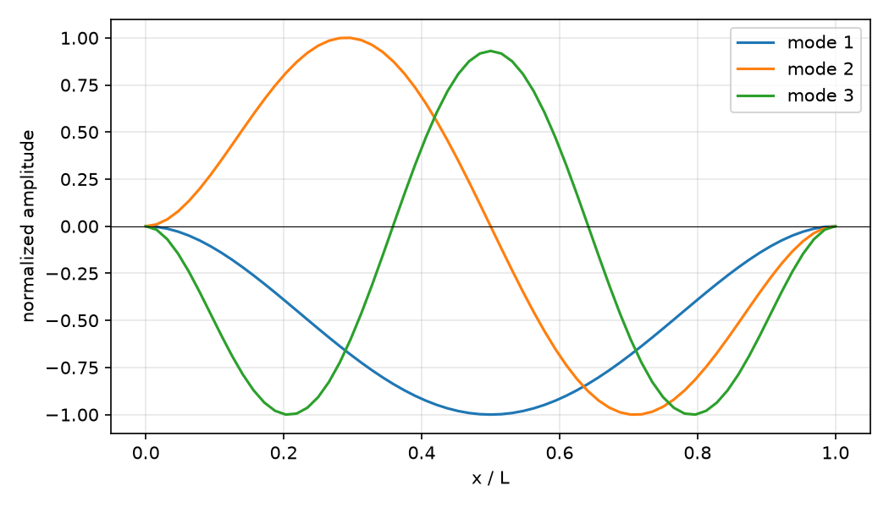
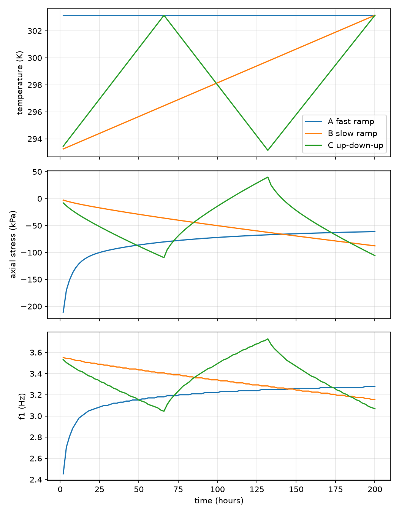

# resonator-fem

Finite element modal analysis of prestressed beams. C++ with Eigen.

Computes natural frequencies of a beam under axial load, and how those
frequencies drift when temperature and humidity histories generate stress
in a restrained member.

First three mode shapes, clamped-clamped.

Three temperature histories reaching the same final temperature produce
different final stress and frequency.
